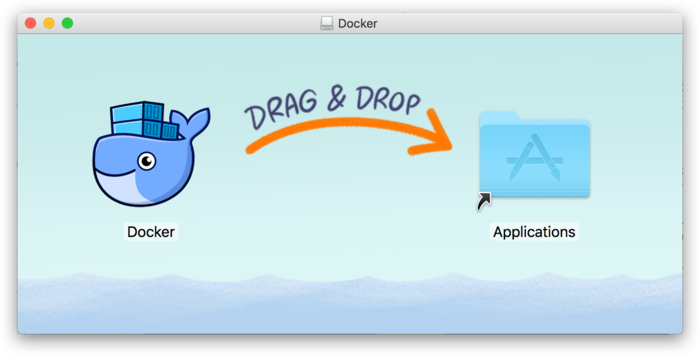
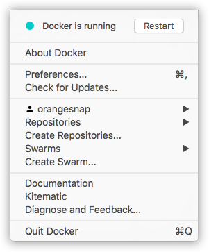
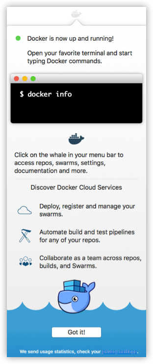
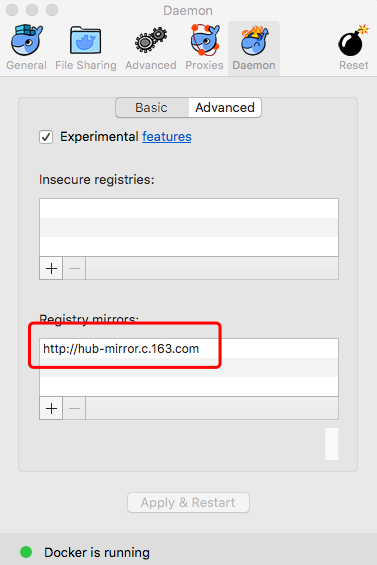

# CentOS Docker 安装
## CentOS/RedHat  安装

- CentOS 7 (64-bit)
- CentOS 6.5 (64-bit) 或更高的版本

### 前提条件

目前，CentOS 仅发行版本中的内核支持 Docker。

Docker 运行在 CentOS 7 上，要求系统为64位、系统内核版本为 3.10 以上。

Docker 运行在 CentOS-6.5 或更高的版本的 CentOS 上，要求系统为64位、系统内核版本为 2.6.32-431 或者更高版本。

###使用 yum 安装（CentOS 7/RedHat 7）

Docker 要求 CentOS 系统的内核版本高于 3.10 ，查看本页面的前提条件来验证你的CentOS 版本是否支持 Docker 。

通过 uname -r 命令查看你当前的内核版本

     $ uname -r 
     
###安装 Docker

从 2017 年 3 月开始 docker 在原来的基础上分为两个分支版本: Docker CE 和 Docker EE。

Docker CE 即社区免费版，Docker EE 即企业版，强调安全，但需付费使用。

本文介绍 Docker CE 的安装使用。

移除旧的版本：

    $ sudo yum remove docker \
                      docker-client \
                      docker-client-latest \
                      docker-common \
                      docker-latest \
                      docker-latest-logrotate \
                      docker-logrotate \
                      docker-selinux \
                      docker-engine-selinux \
                      docker-engine
安装一些必要的系统工具：

    $ sudo yum install -y yum-utils device-mapper-persistent-data lvm2
添加软件源信息：

    $ sudo yum-config-manager --add-repo http://mirrors.aliyun.com/docker-ce/linux/centos/docker-ce.repo
更新 yum 缓存：

    $ sudo yum makecache fast

### 安装 Docker-ce

    $ sudo yum -y install docker-ce
启动 Docker 后台服务

    $ sudo systemctl start docker
测试运行 hello-world

    $ docker run hello-world

由于本地没有hello-world这个镜像，所以会下载一个hello-world的镜像，并在容器内运行。

###使用脚本安装 Docker

1、使用 sudo 或 root 权限登录 Centos。

2、确保 yum 包更新到最新。

$ sudo yum update
3、执行 Docker 安装脚本。

    $ curl -fsSL https://get.docker.com -o get-docker.sh
    $ sudo sh get-docker.sh
执行这个脚本会添加 docker.repo 源并安装 Docker。

4、启动 Docker 进程。

    $ sudo systemctl start docker
5、验证 docker 是否安装成功并在容器中执行一个测试的镜像。

    $ sudo docker run hello-world
    $ docker ps
到此，Docker 在 CentOS 系统的安装完成。

###镜像加速

鉴于国内网络问题，后续拉取 Docker 镜像十分缓慢，我们可以需要配置加速器来解决，我使用的是网易的镜像地址：http://hub-mirror.c.163.com。

新版的 Docker 使用 /etc/docker/daemon.json（Linux）来配置 Daemon。

请在该配置文件中加入（没有该文件的话，请先建一个）：

>{
  "registry-mirrors": ["http://hub-mirror.c.163.com"]
}

###删除 Docker CE

执行以下命令来删除 Docker CE：

    $ sudo yum remove docker-ce
    $ sudo rm -rf /var/lib/docker
    

## MacOS Docker 安装
### 使用 Homebrew 安装

macOS 我们可以使用 Homebrew 来安装 Docker。

Homebrew 的 Cask 已经支持 Docker for Mac，因此可以很方便的使用 Homebrew Cask 来进行安装：

    $ brew cask install docker

> ==> Creating Caskroom at /usr/local/Caskroom
==> We'll set permissions properly so we won't need sudo in the future
Password:          # 输入 macOS 密码
==> Satisfying dependencies
==> Downloading https://download.docker.com/mac/stable/21090/Docker.dmg
######################################################################## 100.0%
==> Verifying checksum for Cask docker
==> Installing Cask docker
==> Moving App 'Docker.app' to '/Applications/Docker.app'.
&#x1f37a;  docker was successfully installed!

在载入 Docker app 后，点击 Next，可能会询问你的 macOS 登陆密码，你输入即可。之后会弹出一个 Docker 运行的提示窗口，状态栏上也有有个小鲸鱼的图标（）。

### 手动下载安装

如果需要手动下载，请点击以下链接下载 Stable 或 Edge 版本的 Docker for Mac。

如同 macOS 其它软件一样，安装也非常简单，双击下载的 .dmg 文件，然后将鲸鱼图标拖拽到 Application 文件夹即可。

从应用中找到 Docker 图标并点击运行。可能会询问 macOS 的登陆密码，输入即可。

点击顶部状态栏中的鲸鱼图标会弹出操作菜单。

第一次点击图标，可能会看到这个安装成功的界面，点击 "Got it!" 可以关闭这个窗口。

启动终端后，通过命令可以检查安装后的 Docker 版本。

    $ docker --version
> Docker version 17.09.1-ce, build 19e2cf6
镜像加速

鉴于国内网络问题，后续拉取 Docker 镜像十分缓慢，我们可以需要配置加速器来解决，我使用的是网易的镜像地址：http://hub-mirror.c.163.com。

在任务栏点击 Docker for mac 应用图标 -> Perferences... -> Daemon -> Registry mirrors。在列表中填写加速器地址即可。修改完成之后，点击 Apply & Restart 按钮，Docker 就会重启并应用配置的镜像地址了。

之后我们可以通过 docker info 来查看是否配置成功。

    $ docker info
> ...
Registry Mirrors:
 http://hub-mirror.c.163.com
Live Restore Enabled: false

